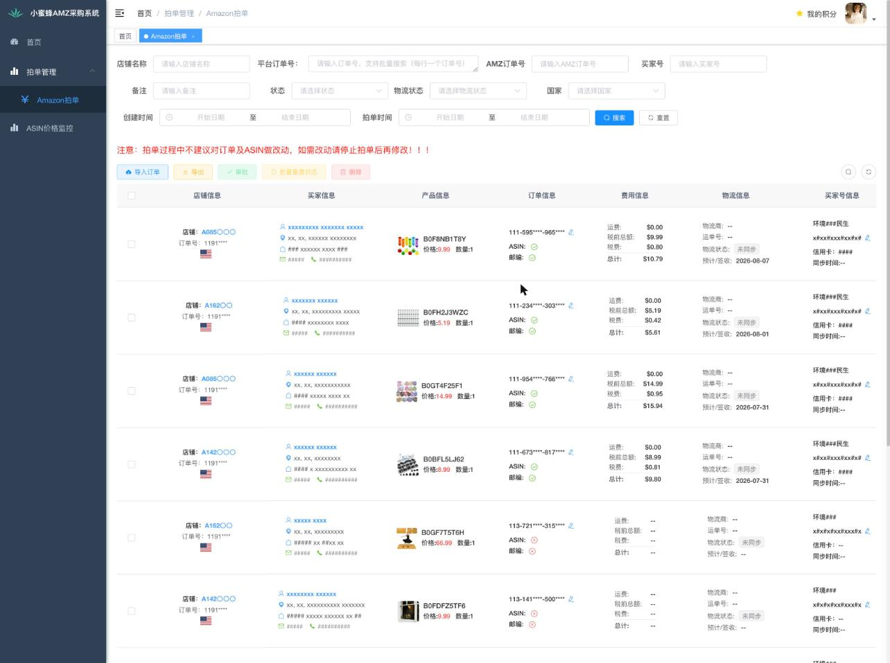
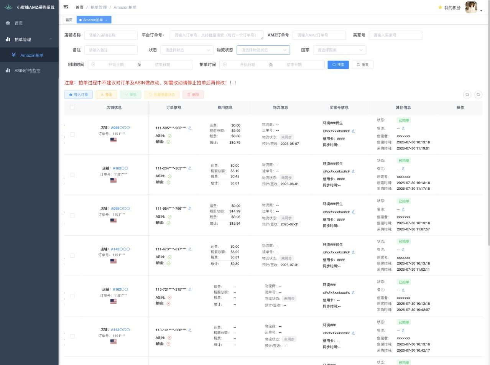
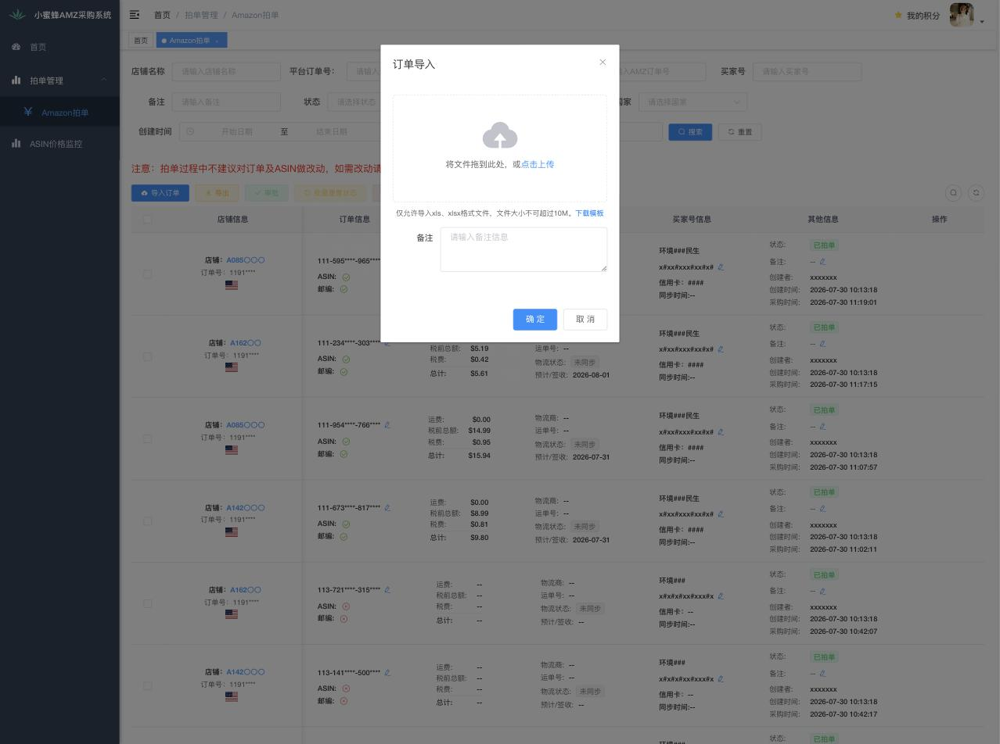
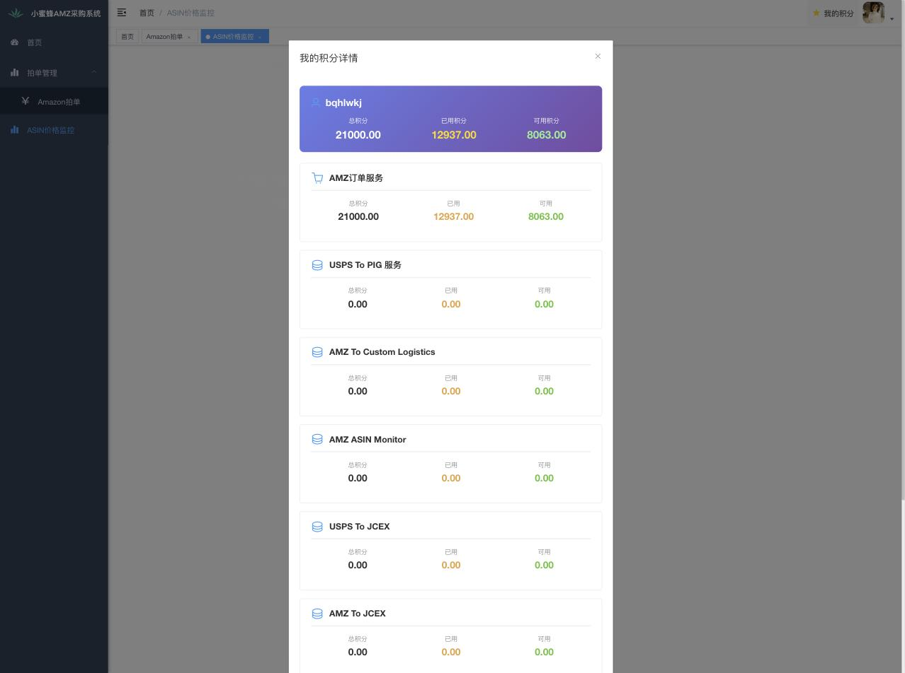
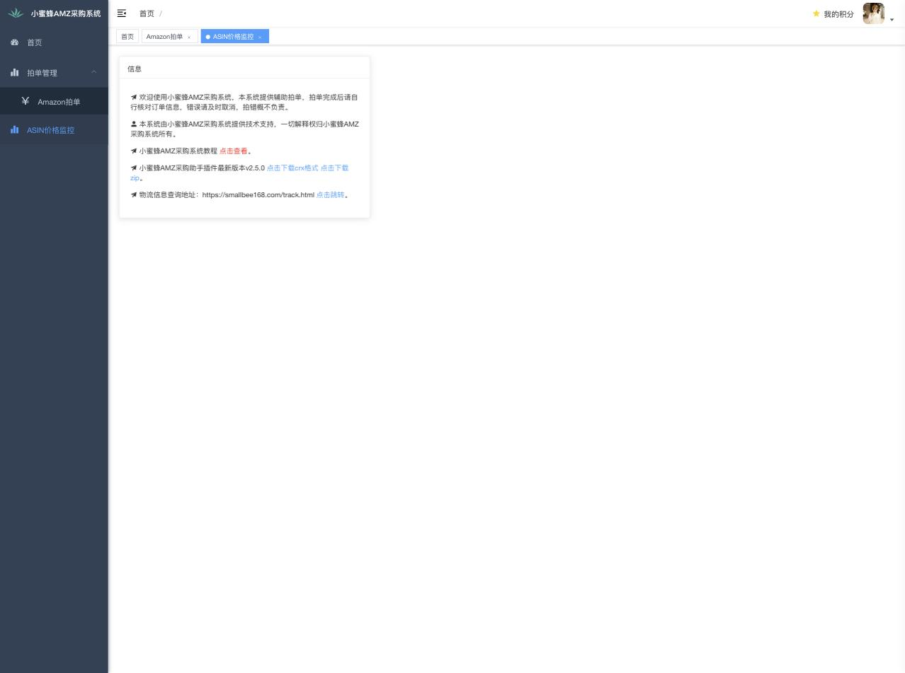

# 小蜜蜂AMZ采购系统（厂商面板）字段级分析报告

- 分析时间：2026-07-30
- 面板：smallbee168.com（Vue SPA + RuoYi 后端，接口前缀 /prod-api/）
- 视角：普通租户账号（非管理员），当前数据规模 12,963 单
- 方法：只读观察 —— 页面 DOM、前端路由/模板产物、列表接口返回体、导入模板 xlsx。**未执行任何写操作**（没有提交审批、重置、删除、导入）
- 脱敏：客户姓名、地址、电话、邮编、买家号ID、信用卡后四位在正文和截图中一律掩码

---

## 0. 一页结论

1. 面板只有 3 个业务页面，实际工作量 100% 集中在一张「Amazon拍单」列表上。
2. **没有买家账号管理页**。前端代码里搜不到 验证码 / 风控 / 心跳 / 代理 / 账号状态 任何一个词。账号在面板里只是订单上的三个字段：买家号（值其实是防关联浏览器的环境名，形如 环境1xx）、买家号ID（亚马逊 A1... 客户号）、信用卡后四位，外加一个「同步时间」。账号是否存活、验证码接力、一个环境挂几个插件，面板完全不管。
3. 任务状态只有 4 个：待审核(0) / 待拍单(21) / 已拍单(1) / 拍单异常(99)。物流状态是另一条独立枚举。**没有「已回填」态** —— 回填完成就是「已拍单」。
4. **派单不在面板里发生**：导入 Excel 时「买家号」列就已经指定好了，插件按环境自己拉活，所以他们没有 unassigned/assigned/claimed 这三个中间态。
5. **没有涨价护栏**。接口返回 priceCheck 字段，但前端模板 0 处引用；界面上只有 ASIN 一致性、邮编一致性两个红叉标记，加一条「配送时间超过 7 天」的黄色告警。

---

## 1. 页面清单

| 页面 | 路径 | 解决什么问题 |
| --- | --- | --- |
| 首页 | /index | 纯公告页：教程链接、插件最新版本下载（v2.5.0 crx/zip）、外部物流查询页 track.html。没有任何看板或统计 |
| Amazon拍单 | /order/amazonOrder | 唯一的业务页：任务列表 + Excel 导入 + 采购结果展示 + 人工修正 |
| ASIN价格监控 | /asinMonitor | ASIN 售卖价 vs AMZ 价的盈亏监控（当前无数据） |
| 个人中心 | /user/profile | 账号资料 |
| 我的积分（弹窗） | 顶栏入口 | 按服务分账的额度显示 |

菜单来自动态路由接口 /prod-api/getRouters，就这几项。**没有**账号管理、店铺管理、物流商配置、用户/权限、报表。

---

## 2. 字段表

### 2.1 筛选区（9 个可见 + 5 个接口存在但界面没有）

| 界面标签 | 参数名 | 类型 | 备注 |
| --- | --- | --- | --- |
| 店铺名称 | storeName | string | 模糊匹配 |
| 平台订单号 | orderNo | textarea | **支持批量，每行一个**（注意：这里指上游店铺订单号，不是亚马逊单号） |
| AMZ订单号 | platformOrderNo | string | 亚马逊 111-xxxxxxx-xxxxxxx |
| 买家号 | buyerAccount | string | 实际是环境名 |
| 备注 | remark | string | 导入批次备注 |
| 状态 | status | 单选 | 0/21/1/99，见状态机 |
| 物流状态 | orderStatus | **多选** | 0/1/2/3/91 |
| 国家 | country | 单选 | US / CA / JP |
| 创建时间 | createTimeStart / createTimeEnd | 日期区间 | 导入时间 |
| 拍单时间 | purchaseTimeStart / purchaseTimeEnd | 日期区间 | 实际下单时间 |

接口里存在、界面上没有暴露的参数：buyerCustomerId、logisticsNo、needUpdate、abnormalOrders、shippingStatus（后两个各只在初始化处出现 1 次，属于死参数）。

命名陷阱：**platformOrderNo 存的是亚马逊订单号，orderNo 存的是上游订单号+ASIN 拼接的行级唯一号**（例：11912129487xxxx + B0F8NB1T8Y）。跟直觉相反，接字段时别搞错。

### 2.2 列表列（9 列，无任何列可排序，默认按 id 倒序）

| 列 | 内容 |
| --- | --- |
| 店铺信息 | 店铺账号、订单号（可复制）、国旗 |
| 买家信息 | 收货人姓名、国家/州/城市、详细地址、邮编、电话 |
| 产品信息 | 商品缩略图（m.media-amazon.com）、ASIN（**可就地编辑**）、价格、数量；商品失效时提示「商品缺货或不在售，请确认商品有效性」 |
| 订单信息 | AMZ订单号（**可就地编辑**）+ 两个一致性校验：ASIN（导入值 vs 同步值）、邮编（导入值 vs 同步值），一致打绿勾、不一致打红叉 |
| 费用信息 | 运费、税前总额、税费、总计（回填，字符串带 $ 符号） |
| 物流信息 | 物流商、运单号（可复制）、物流状态标签、预计/签收日期；配送时间 > 7 天时出现「配送时间异常」黄色告警 |
| 买家号信息 | 买家号（环境名）、买家号ID、信用卡后四位、同步时间；带编辑按钮 |
| 其他信息 | 状态标签、异常时的「查看异常详情」、备注（可就地编辑）、创建者、创建时间、采购时间 |
| 操作 | 修改地址、删除 |

分页：10 / 20 / 30 / 50 / 100 / 200 / 400 / 500 / 1000 / 2000 / 3000 / 4000 / 5000 条每页。默认 10。

### 2.3 列表接口行模型（POST /prod-api/system/amazonOrder/list，38 字段）

| 分组 | 字段 | 说明 |
| --- | --- | --- |
| 标识 | id, storeName, orderNo, platformOrderNo | orderNo=上游单号+ASIN；platformOrderNo=AMZ 单号 |
| 账号 | buyerAccount, buyerCustomerId, paymentCard | 环境名 / 亚马逊客户号 / 卡后四位 |
| 收货 | receivingName, receivingCountry, receivingState, receivingCity, receivingDistrict, receivingAddress, receivingPhone, receivingPostCode, platformPostCode | platformPostCode = 同步回来的邮编，用于比对 |
| 商品 | asin, products[]（id, orderId, asin, country, quantity, imgUrl, price, status） | 支持多商品行 |
| 费用回填 | subTotal, shipping, totalBeforeTax, tax, total | 均为字符串（含 $），subTotal 实测常为 null |
| 物流回填 | platformTrackCarrier, platformTrackNo, deliveryTime, deliveryTimeAbnormal | deliveryTimeAbnormal=1 触发配送时间告警 |
| 状态 | status, orderStatus, failContent | status=任务态；orderStatus=物流态；failContent=异常原文 |
| 校验位 | asinCheck, postCodeCheck, priceCheck | 布尔；**priceCheck 前端 0 处引用** |
| 审计 | remark, createName, createTime, updateTime, purchaseTime | createTime=导入时间（同批次完全相同），purchaseTime=实际下单时间 |

### 2.4 导入模板（唯一的输入契约，/amazon_order_template.xlsx，15 列，按表头顺序）

| # | 列名 | 备注 |
| --- | --- | --- |
| 1 | 店铺账号 | |
| 2 | 平台订单号 | 上游订单号 |
| 3 | 收货人姓名 | |
| 4 | 收货人地址 | |
| 5 | 收货人城市 | |
| 6 | 收货人州/省 | |
| 7 | 邮编 | |
| 8 | 收货人电话 | |
| 9 | AMZ订单号 | 导入时可留空，拍单后回填 |
| 10 | 买家号 | **派哪个账号在这里就定了** |
| 11 | 买家号ID | |
| 12 | 收货人国家 | US / CA / JP |
| 13 | ASIN | 多商品用英文逗号并列，如 B000UVNIIK,B0FB3VS68J |
| 14 | 数量 | 与 ASIN 一一对应，如 2,1 |
| 15 | 收货人区 | 模板注明「地区为日本时必填」 |

导入限制：仅 xls / xlsx，≤ 10M，可带一个批次「备注」，走 POST /prod-api/system/amazonOrder/importOrder（带 updateSupport 开关）。

### 2.5 人工修正弹窗字段

- 修改收货地址：receivingName, receivingPhone, receivingCountry, receivingState, receivingCity, receivingDistrict, receivingAddress, receivingPostCode
- 编辑买家号信息：buyerAccount（买家号名称）, buyerCustomerId（买家号ID）
- 就地编辑：ASIN、AMZ订单号、备注（各自独立接口）

---

## 3. 状态机

### 3.1 任务状态机（字段 status）

```
   [Excel 导入]
        |
        v
   待审核 (0) --审批--> 待拍单 (21) --插件拍单成功--> 已拍单 (1)
                            |
                            +--拍单失败--> 拍单异常 (99)
                                              |
                                          批量重置状态
                                              |
                                              v
                                         待拍单 (21)
```

| 状态 | 值 | 允许的操作 | 约束（界面原文） |
| --- | --- | --- | --- |
| 待审核 | 0 | 审批、修改地址、编辑 ASIN/备注、删除 | 「只有状态为"待审核"的订单才能进行审批操作」；「审批通过后，订单状态将变更为"待拍单"」 |
| 待拍单 | 21 | 修改地址、编辑 ASIN/备注、删除 | 页面顶部红字：「拍单过程中不建议对订单及ASIN做改动，如需改动请停止拍单后再修改」 |
| 已拍单 | 1 | 编辑 AMZ订单号、编辑买家号信息、编辑备注、修改地址、批量更新发货状态、删除 | 回填即终态，没有二次确认 |
| 拍单异常 | 99 | 查看异常详情、批量重置状态（唯一可选目标：待拍单）、编辑、删除 | 「只有状态为"拍单异常"的订单才能进行重置操作」 |

实测分布：12,963 单全部为「已拍单」，待审核 / 待拍单 / 拍单异常 均为 0 条 —— 说明审批和待拍单在这条链路上是瞬时态，审批环节形同虚设。

### 3.2 物流状态（字段 orderStatus，与任务状态完全独立）

| 值 | 名称 | 实测条数 |
| --- | --- | --- |
| 0 | 未同步 | 129 |
| 1 | 已签收 | 12,695 |
| 2 | 运输中 | 102 |
| 3 | 未发货 | 25 |
| 91 | 已取消 | 10 |

注意一个坑：「批量更新发货状态」弹窗里只有两个选项 未发货(0) / 已发货(1)，语义与上面的展示枚举（1=已签收）不一致，走的是另一个接口 updateShippingStatus。接字段时不要把这两套枚举合并。

### 3.3 账号状态机 —— **面板侧不存在**

没有账号列表、没有站点/余额/日采量/最近活跃时间、没有心跳或最近同步时间（订单上的「同步时间」是订单级的，不是账号级）、没有验证码/风控/封号的任何状态展示与恢复入口、没有账号与插件实例的绑定关系。

唯一的线索是：买家号字段的值是防关联浏览器的环境名（环境1xx+人名），也就是**他们把「账号」等同于「浏览器环境」**，一个环境就是一条产能通道。账号健康度全部在插件/浏览器侧，面板不可见。

结论：账号状态机我们必须自己设计，没有可对标物。

---

## 4. 操作清单（按钮 → 接口 → 前置条件）

| 操作 | 接口 | 前置条件 / 说明 |
| --- | --- | --- |
| 搜索 / 重置 | POST /system/amazonOrder/list?pageNum&pageSize | 分页在 query，过滤条件在 body |
| 导入订单 | POST /system/amazonOrder/importOrder | xls/xlsx ≤10M，可填批次备注 |
| 导出 | POST /system/amazonOrder/export | 按当前筛选条件导出 |
| 审批 | POST /system/amazonOrder/approvalOrder | 需勾选；仅「待审核」；不符合会提示「只能审批待审核状态的订单，以下订单状态不符合要求：」 |
| 批量重查状态（弹窗标题「批量重置状态」） | POST /system/amazonOrder/updateOrderStatusBatch | 需勾选；仅「拍单异常」；目标状态只能选「待拍单」 |
| 批量更新发货状态 | POST /system/amazonOrder/updateShippingStatus | 需勾选；选 未发货/已发货 |
| 删除 | DELETE /system/amazonOrder/{ids} | 需勾选；确认文案「是否确认删除Amazon拍单信息编号为"…"的数据项？」 |
| 修改收货地址 | POST /system/amazonOrder/updateOrderReceivingInfo | 行级 |
| 编辑买家号信息 | POST /system/amazonOrder/updateBuyerInfo | 行级；可改环境名和买家号ID |
| 编辑 AMZ订单号 | POST /system/amazonOrder/updateAmzOrderNo | 行级就地编辑 |
| 编辑商品 ASIN | POST /system/amazonOrder/updateOrderProductAsin | 行级就地编辑 |
| 编辑备注 | POST /system/amazonOrder/updateRemark | 行级就地编辑 |
| 我的积分 | 顶栏弹窗 | 见第 7 节 |

---

## 5. 异常类型与处置对照表

面板侧只有一个笼统的异常态，没有异常分类枚举：

| 异常表现 | 界面原文 | 运营可做的动作 |
| --- | --- | --- |
| 拍单失败（统称） | 状态标签「拍单异常」+「查看异常详情」（展示 failContent 原文） | 批量重置状态 → 待拍单（等于重试）；或改地址/改 ASIN 后再重置；或删除 |
| 商品失效 | 「商品缺货或不在售，请确认商品有效性」 | 就地编辑 ASIN |
| ASIN 不一致 | 订单信息列 ASIN 红叉（导入值 vs 同步值） | 人工核对，编辑 ASIN 或 AMZ订单号 |
| 邮编不一致 | 订单信息列 邮编 红叉 | 修改收货地址 |
| 配送超期 | 「订单配送时间超过 7 天，请检查订单」/「配送时间异常」 | 无系统动作，纯提示 |
| 涨价 | **无任何提示**（priceCheck 字段未使用） | 无 |
| 验证码 / 风控 / 账号异常 | **面板无此概念** | 只能在插件/浏览器侧处理 |

**没有**「改派其他账号」这个动作 —— 因为买家号是导入时定的，要换账号只能改导入或直接编辑买家号信息字段。也**没有**「转人工」状态，异常单就停在 99 等人处理。

缺口：本次账号内 0 条异常单，failContent 的实际措辞抄不到，等出现异常时补录。

---

## 6. 「我不用的功能」清单（建议我们不做）

- ASIN价格监控整页（当前 0 条数据；其状态枚举是 AVAILABLE_DATE 预售 / IN_STOCK 在售 / IN_STOCK_SCARCE 低库存 / OUT_OF_STOCK 缺货）
- 审批环节（实测 0 条待审核，导入后直接进入拍单）
- 除「AMZ订单服务」外的 5 个积分服务，额度全为 0：USPS To PIG、AMZ To Custom Logistics、AMZ ASIN Monitor、USPS To JCEX、AMZ To JCEX
- 列「显示/隐藏」配置
- 死参数：needUpdate、abnormalOrders、shippingStatus（查询用）、logisticsNo、buyerCustomerId 查询
- 加拿大 / 日本站点（实际数据全为 US；日本才需要的「收货人区」字段可以先不做）
- 大页码分页（1000~5000 条每页）

---

## 7. 「他们架构特有、我们不需要」清单

这些都是因为队列在厂商云上、订单靠文件搬进去才存在的中间层，我们订单本来就在自己库里，少一跳：

- **同步时间 / 未同步 状态**：订单级的「同步时间」和物流状态 0=未同步，本质是等插件回传的等待态
- **导入值 vs 同步值双份存储 + 一致性校验**（asinCheck / postCodeCheck、platformPostCode 这个影子字段）：因为数据是从 Excel 搬进去的，需要事后比对我们直接读自己的订单，不需要
- **Excel 导入通道**（importOrder / 导入模板 / 批次备注 / updateSupport）
- **积分扣费体系**：AMZ订单服务 总额 21000 / 已用 12937 / 可用 8063，约 1 单 1 积分
- **插件版本分发与「插件更新通知」弹窗**（首页挂 crx/zip 下载，接口 /system/notice/pluginUpdateNotice 会轮询）
- **双编号**（orderNo 与 platformOrderNo 混用，orderNo 还是上游单号+ASIN 拼出来的）
- **外部物流查询页 track.html**

---

## 8. 与 R2-13 的映射对照

| 我们的状态 | 他们的对应 | 说明 |
| --- | --- | --- |
| unassigned | 无 | 他们导入时就带买家号 |
| assigned | 无 | 同上，派单在上游 |
| claimed | 无 | 插件自己拉活，面板看不到「已领取」 |
| purchased | 已拍单 (1) | |
| shipped | orderStatus 2 运输中 / 1 已签收 | 他们把发货/签收放在独立枚举里，不占任务状态 |
| backfilled | 无 | 回填与已拍单同态，没有二次确认 |
| exception | 拍单异常 (99) | 无子类型 |
| — | 待审核 (0) | **他们比我们多的中间态**：导入后先人工过一遍再放给插件。实测他们自己也没在用（0 条），但这个位置对我们有价值：可以挂护栏校验（金额上限、涨价阈值、账号日限），把校验失败的单卡在这里而不是放出去拍 |

我们特有、他们完全没有的（无需再找对标）：代理出口绑定、店铺关联、三档档位与护栏、迁移期双轨可视化及「同一浏览器不得同时开两个插件」这条红线。

---

## 9. 截图附录

| 图 | 内容 | 说明 |
| --- | --- | --- |
|  | 拍单列表主视图（已脱敏） | 筛选区、红字警告、操作按钮条、店铺/买家/产品/订单/费用/物流/买家号 各列 |
|  | 列表右侧列（已脱敏） | 费用、物流、买家号、其他信息（状态/备注/创建者/创建时间/采购时间）、操作 |
|  | 订单导入弹窗 | 拖拽上传、xls/xlsx ≤10M、下载模板、批次备注 |
|  | 我的积分详情 | 6 个服务分账，仅 AMZ订单服务 有额度 |
|  | ASIN价格监控 | 空列表；列为 店铺名称/ASIN/国家/售卖价格/AMZ价格/盈亏/创建时间/更新时间 |

截图中的客户姓名、地址、电话、邮编、买家号ID、卡后四位、店铺人名均已用 x / # / 〇 掩码替换。缺「拍单异常」和「待审核」状态的截图 —— 当前账号无此类数据。

---

## 10. 本次未覆盖的缺口

1. failContent 的实际异常措辞（当前 0 条异常单）
2. 导出文件的列清单（导出会触发文件下载，未执行）
3. 各写接口的请求体细节（只读原则，未提交任何写操作）
4. 插件侧的一切：账号健康、验证码接力（showVerificationOverlay）、环境与插件实例绑定、并发控制 —— 面板不可见，需要直接看插件源码
